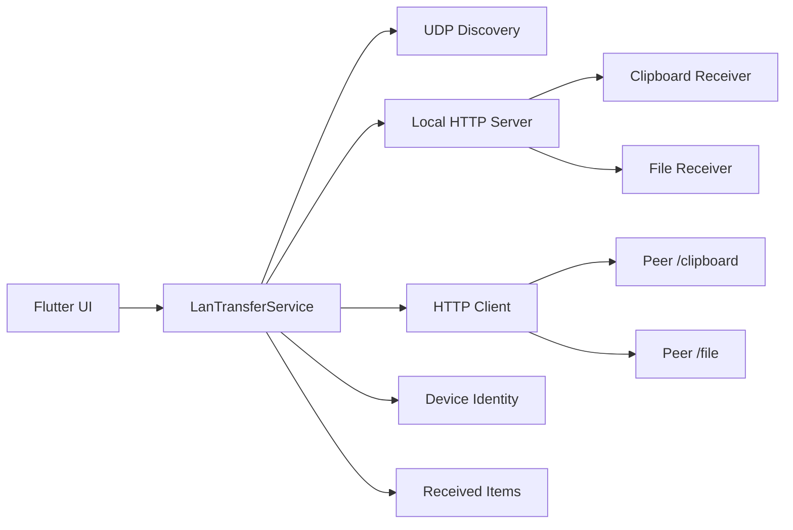
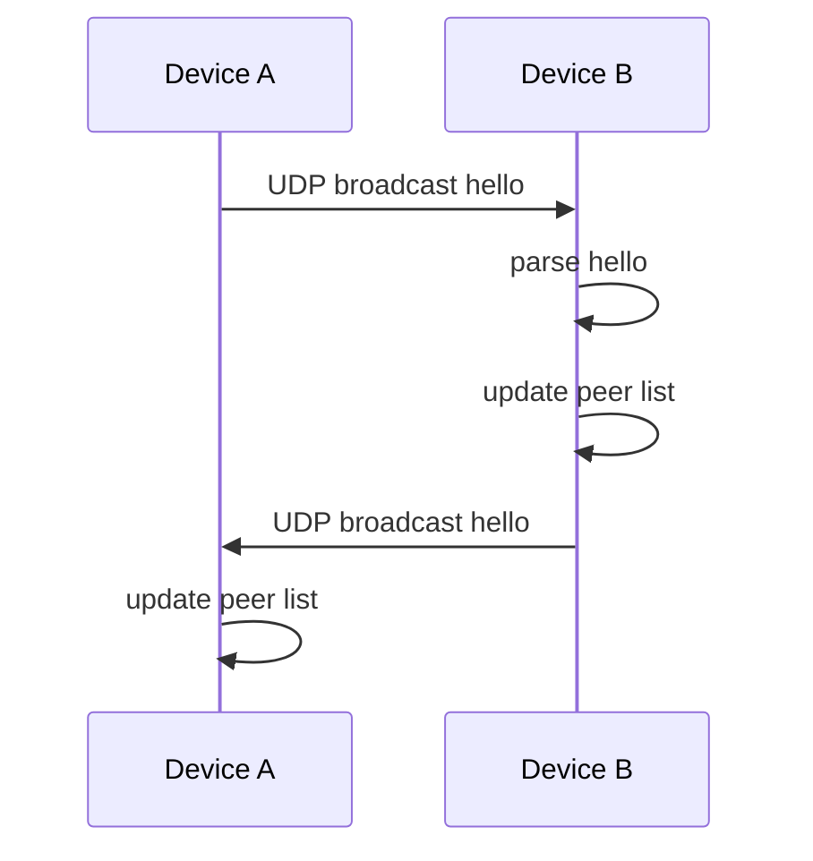
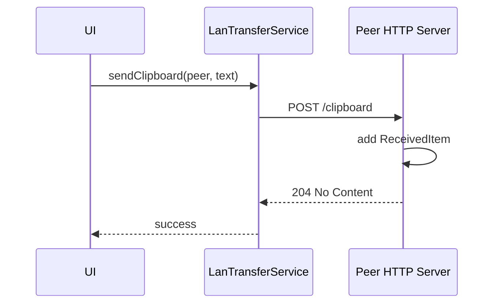
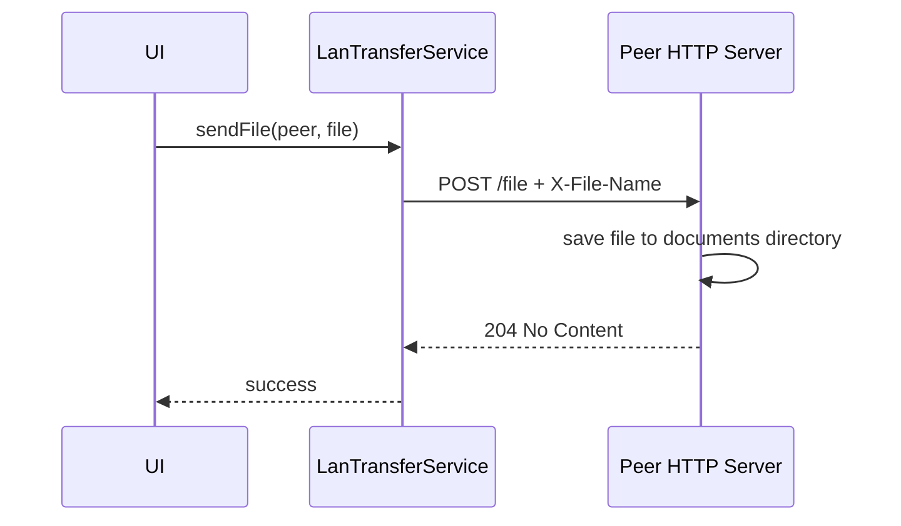

# 架构设计

## 设计目标

LAN Transfer Clipboard 的核心目标是让同一局域网内的设备不经过云端即可互相发送文件和剪贴板文本。

架构优先级：

- 跨平台：同一套业务代码覆盖 macOS、Windows、Android、iOS。
- 局域网优先：不依赖公网服务器，不要求账号登录。
- 简单可调试：MVP 采用 UDP + HTTP，便于抓包、排错和演进。
- 可生产化：后续可以逐步加入配对、加密、权限确认和后台任务。

## 总体结构

## 应用启动流程

1. `main.dart` 初始化 Flutter 绑定。
2. 创建 `LanTransferService`。
3. 调用 `LanTransferService.start()`。
4. 加载或创建本机稳定设备 ID。
5. 在随机可用端口启动本机 HTTP server。
6. 绑定 UDP `45671` 端口。
7. 发送首次 `hello` 心跳。
8. 启动周期性心跳和离线设备清理定时器。
9. 渲染 `HomeScreen`。

## 模块职责

### `LanTransferService`

核心服务层，负责：

- 设备发现。
- 本机 HTTP server。
- 剪贴板发送。
- 文件发送。
- 接收记录维护。
- 在线设备列表维护。

### `DeviceIdentity`

负责生成和持久化设备 ID。

当前实现会在应用支持目录中创建 `device-id` 文件。设备 ID 用于避免收到自己的 UDP 心跳，也用于稳定识别同一台设备。

### `LanPeer`

表示一个在线远端设备，包括：

- `deviceId`
- `deviceName`
- `platform`
- `host`
- `port`
- `lastSeen`

### `ReceivedItem`

表示一个接收记录。当前支持两种类型：

- `clipboard`
- `file`

接收记录会持久化到应用支持目录中的 `received-items.json`，最多保留最近 300 条。记录只保存元数据：类型、标题、文本或文件路径、接收时间；文件本体仍保存在平台接收目录。

### `HomeScreen`

应用主界面，包含三个区域：

- 在线设备列表。
- 发送操作区。
- 接收记录区。

宽屏使用三栏布局，窄屏使用纵向滚动布局。

收件箱默认显示最近 20 条记录，底部“显示更多”按钮每次继续展开 20 条，避免历史记录过多时影响首屏扫描。

## 网络模型

每台设备同时扮演客户端和服务端：

- 服务端：监听本机 HTTP 端口，接收其他设备传来的内容。
- 客户端：向选中的远端设备发送 HTTP 请求。
- 发现节点：周期性广播自己的设备信息，同时监听其他设备广播。

发现广播会同时发往 `255.255.255.255` 和根据本机 IPv4 推导出的 `/24` directed broadcast 地址。收到自身 `deviceId` 的心跳会被过滤；超过 15 秒没有更新的 peer 会从在线列表移除。Android 端额外持有 `WifiManager.MulticastLock`，避免部分设备在普通 Wi-Fi 模式下漏收 UDP 广播。

## 数据流

### 发现设备

### 发送剪贴板

### 发送文件

## 当前实现边界

当前实现适合用于验证产品方向和核心链路，但还不是安全的生产版本。

已知边界：

- 没有身份认证。
- 没有传输加密。
- 没有接收确认。
- 没有文件大小限制。
- 没有断点续传。
- 没有传输进度。
- 没有后台服务。
- 没有跨子网发现。
- 发现能力仍依赖当前 Wi-Fi/路由器是否允许 UDP broadcast 和设备互访。

## 演进方向

推荐演进顺序：

1. 加入设备配对。
2. 引入端到端加密。
3. 加入接收确认和来源展示。
4. 增加文件大小限制、进度、取消和失败重试。
5. 用 mDNS/Bonjour 补强 UDP 广播发现。
6. 实现移动端后台任务和通知。
